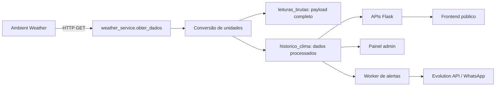
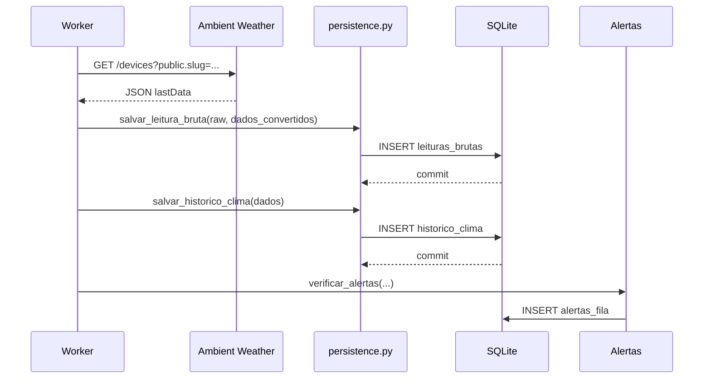

# Sistema Web da Estação Meteorológica

Documentação técnica do sistema Python/Flask usado para coletar, persistir, exibir e alertar dados de uma estação meteorológica pública da Ambient Weather.

> Status deste README: baseado na estrutura real do projeto aberto em `D:\Projetos\EstacaoEmPython`, incluindo os módulos atuais de persistência, timezone, painel público, painel administrativo, APIs, webhook de deploy e worker de coleta.

## Índice

1. [Visão Geral do Projeto](#1-visão-geral-do-projeto)
2. [Arquitetura do Sistema](#2-arquitetura-do-sistema)
3. [Tecnologias Utilizadas](#3-tecnologias-utilizadas)
4. [Estrutura de Pastas](#4-estrutura-de-pastas)
5. [Funcionamento da Estação](#5-funcionamento-da-estação)
6. [Fluxo Completo dos Dados](#6-fluxo-completo-dos-dados)
7. [Banco de Dados](#7-banco-de-dados)
8. [Sistema de Horários e Timezone](#8-sistema-de-horários-e-timezone)
9. [Instalação](#9-instalação)
10. [Configuração](#10-configuração)
11. [Como Executar](#11-como-executar)
12. [APIs e Rotas](#12-apis-e-rotas)
13. [Painel Administrativo](#13-painel-administrativo)
14. [Persistência e Segurança dos Dados](#14-persistência-e-segurança-dos-dados)
15. [Logs e Monitoramento](#15-logs-e-monitoramento)
16. [Tratamento de Erros](#16-tratamento-de-erros)
17. [Testes](#17-testes)
18. [Deploy e Produção](#18-deploy-e-produção)
19. [Backup e Recuperação](#19-backup-e-recuperação)
20. [Melhorias Futuras](#20-melhorias-futuras)
21. [Troubleshooting](#21-troubleshooting)
22. [Comentários Técnicos](#22-comentarios-técnicos)

---

## 1. Visão Geral do Projeto

Este projeto é uma aplicação web para monitoramento meteorológico local do Distrito de São José, Vicentina/MS. Ele consulta dados de uma estação meteorológica publicada na Ambient Weather, grava o histórico em SQLite, mostra informações ao público em páginas web responsivas e envia alertas via WhatsApp para usuários cadastrados.

### Objetivo da Aplicação

O sistema existe para:

- coletar leituras meteorológicas periodicamente;
- persistir dados brutos e processados no banco;
- exibir condições atuais e gráficos históricos;
- manter um painel administrativo para usuários, alertas e debug;
- enviar alertas climáticos críticos por WhatsApp;
- permitir auditoria posterior dos dados recebidos da estação.

### Dados Monitorados

A coleta atual trata estes campos principais:

| Dado | Campo da Ambient Weather | Nome no código | Unidade no sistema |
|---|---|---|---|
| Temperatura | `tempf` | `temp` | Celsius |
| Sensação térmica | `feelsLike` | `sensacao` | Celsius |
| Umidade | `humidity` | `umidade` | % |
| Pressão | `baromrelin` | `pressao` | hPa |
| Índice UV | `uv` | `uv` | índice |
| Radiação solar | `solarradiation` | `radiacao` | W/m2 |
| Vento atual | `windspeedmph` | `vento` | km/h |
| Rajada atual | `windgustmph` | `rajada` | km/h |
| Rajada máxima diária | `maxdailygust` | `rajada_max` | km/h |
| Direção do vento | `winddir` | `vento_dir` | graus |
| Intensidade de chuva | `rainratein` | `chuva_rate` | mm/h |
| Chuva do evento | `eventrainin` | `chuva_evento` | mm |
| Chuva do dia | `dailyrainin` | `chuva_hoje` | mm |
| Timestamp da estação | `dateutc` | `station_timestamp_ms` | epoch ms UTC |
| Bateria | campos contendo `batt` ou `battery` | `bateria` | JSON/texto |
| Sinal | `signal`, `rssi`, etc. | `sinal` | texto |
| Campos extras | qualquer outro campo | `payload_json` | JSON bruto |

### Funcionalidades Principais

- Página pública com dados ao vivo.
- Gráficos de temperatura, vento, chuva semanal, chuva mensal e recordes.
- Página histórica mensal com filtros por mês/ano.
- Página de previsão usando Open-Meteo.
- Cadastro público para receber alertas no WhatsApp.
- Link de cancelamento de alertas.
- Painel administrativo protegido por senha.
- Envio de alertas críticos por WhatsApp via Evolution API.
- Webhooks de deploy para GitHub.
- Worker separado para coleta periódica da estação.
- Persistência bruta imediata para reduzir perda de dados em queda de energia.

### Fluxo Resumido dos Dados



---

## 2. Arquitetura do Sistema

O projeto tem tres processos principais:

1. **Aplicação Flask** (`estacao/app.py`): serve páginas, APIs, admin e webhooks.
2. **Worker de coleta** (`estacao/workers/updater.py`): consulta a estação a cada 15 segundos, persiste dados e enfileira alertas.
3. **Worker de WhatsApp** (`estacao/workers/whatsapp_sender.py`): envia a fila de alertas pela Evolution API sem bloquear a coleta.

Esses processos compartilham o mesmo banco SQLite.

### Backend

O backend é Flask, organizado por Blueprints:

- `routes/public.py`: rotas públicas e cadastro/cancelamento.
- `routes/api.py`: endpoints JSON usados pelos gráficos e frontend.
- `routes/admin.py`: login, painel administrativo e debug.
- `routes/webhook.py`: webhooks de deploy GitHub.

### Frontend

O frontend é renderizado com Jinja2, HTML, Tailwind via CDN, CSS próprio e JavaScript em templates.

Componentes principais:

- `templates/layout.html`: layout base para páginas públicas.
- `templates/index.html`: dashboard ao vivo.
- `templates/historico.html`: histórico mensal.
- `templates/previsao.html`: previsão do tempo.
- `templates/sobre.html`: página institucional.
- `templates/admin_login.html`: login admin.
- `templates/admin_painel.html`: painel administrativo.
- `templates/unsubscribe.html`: feedback de cancelamento.

Os gráficos usam Chart.js via CDN.

### Banco de Dados

O banco é SQLite. O caminho padrão é:

```text
estacao/estacao.db
```

Pode ser alterado pela variável:

```env
ESTACAO_DB=/caminho/absoluto/estacao.db
```

O módulo central é `estacao/database.py`, que configura:

- `PRAGMA journal_mode = WAL`
- `PRAGMA synchronous = FULL`
- `PRAGMA busy_timeout = 30000`
- `PRAGMA foreign_keys = ON`

### Serviços

- `services/weather_service.py`: integra com Ambient Weather e Open-Meteo.
- `services/whatsapp_service.py`: integra com Evolution API.
- `persistence.py`: persistência crítica de leituras brutas e processadas.
- `time_utils.py`: padronização de UTC/local e exibição em `America/Campo_Grande`.

### Threads, Agendamentos e Processos Assíncronos

Não há fila interna nem scheduler no Flask. O comportamento periódico está no processo separado:

```bash
python workers/updater.py
```

Ele executa:

```python
while True:
    executar()
    time.sleep(INTERVALO)
```

`INTERVALO = 15`, portanto a coleta roda a cada 15 segundos.

O webhook de deploy usa `subprocess.Popen`, disparando script externo sem aguardar conclusão.

### Fluxo Interno

```mermaid
flowchart TD
    subgraph Worker
        A[executar] --> B[obter_dados]
        B --> C[salvar_leitura_bruta]
        B --> D[salvar_historico_clima]
        D --> E[verificar_alertas]
        E --> F[enfileirar_alerta]
        F --> G[alertas_fila]
    end

    subgraph WhatsApp
        G --> N[whatsapp_sender.py]
        N --> O[registrar alertas_envios]
    end

    subgraph Flask
        H[/api/clima/] --> I[historico_clima]
        J[/api/historico/] --> I
        K[/admin/] --> I
        L[/] --> M[templates/index.html]
    end

    C --> N[(SQLite)]
    D --> N
    G --> N
    I --> N
```

---

## 3. Tecnologias Utilizadas

### Linguagem e Framework

- **Python**: linguagem principal.
- **Flask 3.1.3**: aplicação web, rotas, Jinja2 e sessões.
- **Jinja2**: renderização server-side dos templates.
- **Werkzeug**: infraestrutura Flask.

### Banco de Dados

- **SQLite**: banco local em arquivo.
- **WAL**: modo de journal para melhorar confiabilidade e concorrência entre app e worker.

### Integrações Externas

- **Ambient Weather**: fonte dos dados da estação.
- **Open-Meteo**: previsão meteorológica.
- **Evolution API**: envio de WhatsApp.
- **GitHub Webhooks**: endpoints de deploy.

### Bibliotecas Importantes

| Biblioteca | Uso real no projeto |
|---|---|
| `Flask` | servidor web |
| `requests` | HTTP para Ambient Weather, Open-Meteo e Evolution API |
| `python-dotenv` | leitura de `.env` |
| `bcrypt` | validação de hash de senha admin |
| `Flask-Limiter` | rate limit em rotas sensíveis |
| `tzdata` | suporte IANA timezone quando necessário |

### Observação Sobre `requirements.txt`

O arquivo `estacao/requirements.txt` contém muitas dependências que não aparecem diretamente no código atual, como `streamlit`, `pandas`, `matplotlib`, `gspread`, `duckdb`, `ortools`, entre outras. Isso sugere que o arquivo foi reaproveitado ou está superdimensionado. Para deploy mínimo, recomenda-se revisar e separar dependências reais da aplicação.

---

## 4. Estrutura de Pastas

```text
.
├── README.md
├── tests/
│   └── test_persistence.py
└── estacao/
    ├── app.py
    ├── database.py
    ├── extensions.py
    ├── init_db.py
    ├── persistence.py
    ├── requirements.txt
    ├── time_utils.py
    ├── routes/
    │   ├── admin.py
    │   ├── api.py
    │   ├── public.py
    │   └── webhook.py
    ├── services/
    │   ├── weather_service.py
    │   └── whatsapp_service.py
    ├── static/
    │   ├── background.jpg
    │   ├── logo.png
    │   └── css/style.css
    ├── templates/
    │   ├── admin_login.html
    │   ├── admin_painel.html
    │   ├── historico.html
    │   ├── index.html
    │   ├── layout.html
    │   ├── previsao.html
    │   ├── sobre.html
    │   └── unsubscribe.html
    └── workers/
        └── updater.py
```

### Responsabilidades

| Caminho | Responsabilidade |
|---|---|
| `estacao/app.py` | cria Flask app, carrega `.env`, registra blueprints |
| `estacao/database.py` | conexão SQLite, PRAGMAs e criação/migração de tabelas |
| `estacao/persistence.py` | persistência crítica de leituras brutas/processadas |
| `estacao/time_utils.py` | UTC/local, timezone e formatação de datas |
| `estacao/extensions.py` | extensões Flask compartilhadas |
| `estacao/init_db.py` | comando simples para inicializar/migrar banco |
| `estacao/routes/` | rotas HTTP |
| `estacao/services/` | integrações externas |
| `estacao/templates/` | páginas Jinja2 |
| `estacao/static/` | CSS e imagens |
| `estacao/workers/updater.py` | processo periódico de coleta e criação de fila de alertas |
| `estacao/workers/whatsapp_sender.py` | processo separado que envia a fila de WhatsApp |
| `tests/test_persistence.py` | testes de persistência, WAL, timezone e integridade |

---

## 5. Funcionamento da Estação

### Origem dos Dados

Os dados são obtidos por HTTP GET em:

```text
https://lightning.ambientweather.net/devices?public.slug=<PUBLIC_SLUG>
```

O `PUBLIC_SLUG` está fixo em `services/weather_service.py`.

### Protocolo

O protocolo usado é HTTP/HTTPS com JSON. Não há comunicação serial, MQTT, WebSocket ou push direto da estação neste projeto.

### Frequencia de Atualizacao

O worker consulta a estação a cada 15 segundos:

```python
INTERVALO = 15
```

### Parsing

`weather_service.obter_dados()`:

1. faz GET na Ambient Weather;
2. valida HTTP;
3. pega `dados["data"][0].get("lastData", dados["data"][0])`;
4. verifica `dateutc`;
5. descarta leituras com mais de 10 minutos;
6. converte unidades;
7. salva a leitura bruta se `persistir_bruto=True`;
8. retorna um dicionario processado.

### Validacao

Validacoes existentes:

- request com timeout de 20 segundos;
- `raise_for_status()`;
- retorno `None` se não houver `data`;
- retorno `None` se leitura tiver mais de 600000 ms;
- valores numéricos ausentes ou inválidos viram padrão, geralmente `0` ou `32` F para temperatura.

### Conversoes

| Conversão | Função |
|---|---|
| Fahrenheit para Celsius | `f_to_c` |
| mph para km/h | `mph_to_kmh` |
| polegadas para mm | `in_to_mm` |
| inHg para hPa | multiplicacao por `33.8639` |

### Persistência

A persistência ocorre em duas camadas:

1. `leituras_brutas`: JSON completo recebido da estação.
2. `historico_clima`: campos convertidos e prontos para consultas/gráficos.

---

## 6. Fluxo Completo dos Dados

### Passo a Passo

1. O worker chama `obter_dados()`.
2. O servico faz request para Ambient Weather.
3. O JSON bruto é lido.
4. O timestamp `dateutc` é validado.
5. Os campos principais são convertidos.
6. A leitura bruta é salva imediatamente em `leituras_brutas`.
7. O worker salva a leitura processada em `historico_clima`.
8. O worker atualiza estado de alertas e verifica limites.
9. Se necessário, grava mensagens pendentes em `alertas_fila`.
10. O worker `whatsapp_sender.py` envia WhatsApp via Evolution API.
11. O envio de alerta é registrado em `alertas_envios`.
12. O frontend consulta APIs JSON.
13. Templates e gráficos exibem dados ao usuário.
14. O admin consulta últimos registros, envios e eventos.

### Fluxo de Persistência



### Saída dos Dados

- `/api/clima`: dashboard ao vivo.
- `/api/historico`: curva diária.
- `/api/historico_semana`: gráfico semanal.
- `/api/historico_mes`: gráfico mensal.
- `/api/historico_consulta`: página histórica.
- `/admin`: debug e administração.

---

## 7. Banco de Dados

### Banco Usado

SQLite em arquivo local.

Configuração central:

```python
PRAGMA busy_timeout = 30000
PRAGMA foreign_keys = ON
PRAGMA journal_mode = WAL
PRAGMA synchronous = FULL
```

### Tabelas

#### `historico_clima`

Armazena a leitura processada usada por gráficos, APIs e admin.

| Coluna | Tipo | Finalidade |
|---|---|---|
| `id` | INTEGER PK AUTOINCREMENT | identificador |
| `temp` | REAL | temperatura em Celsius |
| `sensacao` | REAL | sensacao termica em Celsius |
| `umidade` | REAL | umidade relativa |
| `pressao` | REAL | pressao em hPa |
| `uv` | REAL | índice UV |
| `radiacao` | REAL | radiacao solar |
| `vento_vel` | REAL | vento atual em km/h |
| `vento_rajada` | REAL | rajada atual em km/h |
| `vento_dir` | REAL | direcao do vento em graus |
| `chuva_rate` | REAL | intensidade de chuva em mm/h |
| `chuva_evento` | REAL | acumulado do evento em mm |
| `chuva_hoje` | REAL | acumulado diário em mm |
| `station_timestamp_ms` | INTEGER | timestamp original da estação |
| `station_data_hora_utc` | TEXT | timestamp da estação em UTC ISO |
| `station_data_hora_local` | TEXT | timestamp da estação em America/Campo_Grande |
| `data_hora_utc` | TEXT | hora de persistência em UTC ISO |
| `data_hora_local` | TEXT | hora de persistência local ISO |
| `bateria` | TEXT | dados de bateria em JSON/texto |
| `sinal` | TEXT | sinal/RSSI quando recebido |
| `leitura_bruta_id` | INTEGER | referencia logica para `leituras_brutas.id` |
| `data_hora` | TEXT | campo legado local para compatibilidade |

#### `leituras_brutas`

Armazena tudo que chegou da estação para auditoria.

| Coluna | Tipo | Finalidade |
|---|---|---|
| `id` | INTEGER PK AUTOINCREMENT | identificador |
| `origem` | TEXT | origem da leitura |
| `station_timestamp_ms` | INTEGER | `dateutc` original |
| `station_data_hora_utc` | TEXT | data/hora da estação em UTC |
| `station_data_hora_local` | TEXT | data/hora da estação local |
| `recebido_em` | TEXT | campo local legado |
| `recebido_em_utc` | TEXT | recebimento em UTC |
| `recebido_em_local` | TEXT | recebimento local |
| `persistido_em` | TEXT DEFAULT CURRENT_TIMESTAMP | timestamp SQLite UTC |
| `payload_json` | TEXT | JSON bruto completo |
| `dados_convertidos_json` | TEXT | JSON dos campos convertidos |
| `chuva_rate` | REAL | cópia auditável da chuva rate |
| `chuva_evento` | REAL | cópia auditável da chuva evento |
| `chuva_hoje` | REAL | cópia auditável da chuva diária |
| `bateria` | TEXT | campos de bateria extraidos |
| `sinal` | TEXT | sinal/RSSI extraido |

#### `historico_diario`

Tabela de resumo diário.

| Coluna | Tipo | Finalidade |
|---|---|---|
| `data` | TEXT PRIMARY KEY | dia do resumo |
| `temp_min` | REAL | menor temperatura |
| `temp_max` | REAL | maior temperatura |
| `temp_media` | REAL | média diária |
| `umidade_min` | REAL | menor umidade |
| `umidade_max` | REAL | maior umidade |
| `vento_rajada_max` | REAL | maior rajada |
| `chuva_total` | REAL | maior acumulado `chuva_hoje` do dia |
| `pressao_min` | REAL | menor pressao |
| `pressao_max` | REAL | maior pressao |
| `uv_max` | REAL | maior UV |

#### `usuarios`

Cadastro público de contatos.

| Coluna | Tipo | Finalidade |
|---|---|---|
| `id` | INTEGER PK AUTOINCREMENT | identificador |
| `nome` | TEXT NOT NULL | nome |
| `telefone` | TEXT NOT NULL UNIQUE | telefone |
| `endereco` | TEXT | endereco |
| `ativo` | INTEGER DEFAULT 1 | status |
| `receber_whatsapp` | INTEGER DEFAULT 0 | opt-in |
| `criado_em` | TEXT DEFAULT CURRENT_TIMESTAMP | criado em UTC pelo SQLite |

#### `alertas_envios`

Auditoria de envios WhatsApp.

| Coluna | Tipo | Finalidade |
|---|---|---|
| `id` | INTEGER PK AUTOINCREMENT | identificador |
| `data_hora` | TEXT DEFAULT CURRENT_TIMESTAMP | UTC pelo SQLite |
| `usuario_id` | INTEGER | usuário |
| `nome` | TEXT | nome no momento do envio |
| `telefone` | TEXT | telefone usado |
| `status` | TEXT NOT NULL | `enviado` ou `falhou` |
| `mensagem` | TEXT | mensagem enviada |
| `erro` | TEXT | erro em caso de falha |

#### `alertas_fila`

Fila de alertas pendentes para envio WhatsApp. Criada de forma aditiva; não substitui tabelas históricas de clima.

| Coluna | Tipo | Finalidade |
|---|---|---|
| `id` | INTEGER PK AUTOINCREMENT | identificador |
| `criado_em` | TEXT DEFAULT CURRENT_TIMESTAMP | criação do item |
| `atualizado_em` | TEXT DEFAULT CURRENT_TIMESTAMP | última mudança de status |
| `usuario_id` | INTEGER | usuário |
| `nome` | TEXT | nome no momento do alerta |
| `telefone` | TEXT NOT NULL | telefone normalizado |
| `mensagem` | TEXT NOT NULL | mensagem a enviar |
| `status` | TEXT NOT NULL DEFAULT `pendente` | `pendente`, `enviando`, `enviado` ou `falhou` |
| `tentativas` | INTEGER DEFAULT 0 | total de tentativas |
| `erro` | TEXT | último erro |
| `enviado_em` | TEXT | data/hora de sucesso |

#### `cadastro_eventos`

Auditoria de cadastro/cancelamento.

| Coluna | Tipo | Finalidade |
|---|---|---|
| `id` | INTEGER PK AUTOINCREMENT | identificador |
| `data_hora` | TEXT DEFAULT CURRENT_TIMESTAMP | UTC pelo SQLite |
| `acao` | TEXT NOT NULL | cadastro, cancelamento, duplicado |
| `usuario_id` | INTEGER | usuário relacionado |
| `nome` | TEXT | nome |
| `telefone` | TEXT | telefone |
| `endereco` | TEXT | endereco |
| `receber_whatsapp` | INTEGER | opt-in |
| `detalhe` | TEXT | observação |

#### `logs_persistencia`

Logs persistentes de erro na camada de gravacao.

| Coluna | Tipo | Finalidade |
|---|---|---|
| `id` | INTEGER PK AUTOINCREMENT | identificador |
| `data_hora` | TEXT DEFAULT CURRENT_TIMESTAMP | UTC pelo SQLite |
| `nivel` | TEXT NOT NULL | nivel do log |
| `origem` | TEXT | origem |
| `mensagem` | TEXT NOT NULL | mensagem |
| `detalhe` | TEXT | detalhe técnico |

### Índices

Criados pelo `init_db()`:

- `idx_leituras_brutas_recebido_em`
- `idx_leituras_brutas_station_ts`
- `idx_historico_clima_data_hora`
- `idx_historico_clima_data_hora_utc`
- `idx_historico_clima_data_hora_local`

### Relacionamentos

`historico_clima.leitura_bruta_id` aponta logicamente para `leituras_brutas.id`, mas não há `FOREIGN KEY` declarada no schema atual. Isso preserva compatibilidade com bancos antigos.

### Política de Retenção

Não existe rotina automática de limpeza ou retenção. O banco cresce indefinidamente enquanto o worker estiver ativo.

---

## 8. Sistema de Horários e Timezone

### Timezone Local

O timezone local adotado é:

```text
America/Campo_Grande
```

Modulo responsavel:

```text
estacao/time_utils.py
```

### Padrão Atual

Para novas leituras:

- timestamp original da estação: `station_timestamp_ms`;
- timestamp da estação em UTC: `station_data_hora_utc`;
- timestamp da estação local: `station_data_hora_local`;
- horário de persistência UTC: `data_hora_utc`;
- horário de persistência local: `data_hora_local`;
- campo legado local: `data_hora`.

### Exibicao no Admin

O admin converte timestamps para `America/Campo_Grande`.

Para registros antigos, quando não existe `data_hora_local`, o sistema usa fallback em `data_hora`.

### Riscos Conhecidos

- `CURRENT_TIMESTAMP` do SQLite é UTC. Tabelas como `usuarios`, `alertas_envios` e `cadastro_eventos` usam esse padrão.
- Dados antigos podem ter `data_hora` local sem offset. O sistema trata isso como horário local para histórico.
- Se o servidor Linux estiver com timezone errado, o código ainda converte explicitamente as novas exibições, mas logs de sistema podem divergir.

### Recomendação no Linux

```bash
timedatectl
sudo timedatectl set-timezone America/Campo_Grande
```

Confirmar base IANA:

```bash
ls /usr/share/zoneinfo/America/Campo_Grande
```

---

## 9. Instalação

### Requisitos

- Linux recomendado para produção.
- Python 3.11+ recomendado.
- SQLite 3.
- Git.
- Acesso HTTP/HTTPS externo para Ambient Weather, Open-Meteo e Evolution API.
- `tzdata` instalado no sistema.

### Clonar Projeto

```bash
git clone <URL_DO_REPOSITORIO>
cd EstacaoEmPython
```

### Criar Ambiente Virtual

```bash
python3 -m venv .venv
source .venv/bin/activate
```

### Instalar Dependencias

```bash
pip install --upgrade pip
pip install -r estacao/requirements.txt
```

### Criar Banco

```bash
cd estacao
python init_db.py
```

### Criar `.env`

O projeto carrega `.env` em `app.py` e `whatsapp_service.py`.

Exemplo:

```env
SECRET_KEY=troque-esta-chave

ADMIN_PASSWORD=senha-forte
# ou use ADMIN_PASSWORD_HASH=

WEBHOOK_SECRET=segredo-do-webhook

EVOLUTION_URL=https://sua-evolution-api.example.com
EVOLUTION_API_KEY=chave-da-api
EVOLUTION_INSTANCE=nome-da-instância

PUBLIC_BASE_URL=https://meteo.eesjv.com.br

RATELIMIT_ENABLED=true
PUBLIC_CADASTRO_RATE_LIMIT=60 per hour
SESSION_COOKIE_SECURE=true
SESSION_TIMEOUT_MINUTES=30

FORECAST_CITY=Vicentina
FORECAST_STATE=Mato Grosso do Sul
FORECAST_COUNTRY=Brasil
FORECAST_LABEL=Distrito de São José, Vicentina/MS
FORECAST_LAT=
FORECAST_LON=

ESTACAO_DB=/caminho/absoluto/EstacaoEmPython/estacao/estacao.db
```

---

## 10. Configuração

### Variáveis Obrigatórias

| Variável | Obrigatória | Usada em | Observação |
|---|---:|---|---|
| `SECRET_KEY` | Sim para sessões seguras | `app.py` | Flask session |
| `ADMIN_PASSWORD` ou `ADMIN_PASSWORD_HASH` | Sim | `routes/admin.py` | sem isso o módulo admin falha |
| `WEBHOOK_SECRET` | Sim | `routes/webhook.py` | sem isso o módulo webhook falha |
| `EVOLUTION_URL` | Sim para worker de WhatsApp | `whatsapp_service.py` | sem isso o envio falha ao importar |
| `EVOLUTION_API_KEY` | Sim para worker de WhatsApp | `whatsapp_service.py` | chave Evolution |
| `EVOLUTION_INSTANCE` | Sim para worker de WhatsApp | `whatsapp_service.py` | instância |

### Variáveis Opcionais

| Variável | Padrão | Finalidade |
|---|---|---|
| `RATELIMIT_ENABLED` | `true` | liga/desliga Flask-Limiter |
| `PUBLIC_CADASTRO_RATE_LIMIT` | `60 per hour` | limite de envios do formulario publico de cadastro por IP |
| `SESSION_COOKIE_SECURE` | `false` | usar `true` com HTTPS |
| `SESSION_TIMEOUT_MINUTES` | `30` | timeout de sessão admin |
| `PUBLIC_BASE_URL` | `http://meteo.eesjv.com.br` | base pública do site usada em links |
| `UNSUBSCRIBE_SECRET` | `SECRET_KEY` | chave opcional separada para assinar links de cancelamento |
| `UNSUBSCRIBE_TOKEN_MAX_AGE_DAYS` | `90` | validade dos links de cancelamento |
| `FORECAST_CITY` | `Vicentina` | cidade da previsão |
| `FORECAST_STATE` | `Mato Grosso do Sul` | estado |
| `FORECAST_COUNTRY` | `Brasil` | país |
| `FORECAST_LABEL` | `Distrito de São José, Vicentina/MS` | label exibido |
| `FORECAST_LAT` | vazio | latitude fixa opcional |
| `FORECAST_LON` | vazio | longitude fixa opcional |
| `ESTACAO_DB` | `estacao/estacao.db` | caminho do SQLite |
| `INTERVALO_ENVIO_USUARIOS` | `20` | pausa, em segundos, entre envios do worker de WhatsApp |
| `INTERVALO_WHATSAPP_SEM_FILA` | `5` | pausa quando não há alerta pendente |
| `ALLOWED_DEPLOY_REPO` | `rodrigoraa/EstacaoEmPython` | repo aceito no webhook |
| `ALLOWED_DEPLOY_BRANCH` | `refs/heads/main` | branch aceita no webhook |

### Portas

Em desenvolvimento, `app.py` roda:

```python
host="0.0.0.0", port=8080
```

Em produção, recomenda-se Gunicorn atrás de Nginx/Apache.

---

## 11. Como Executar

### Desenvolvimento

Terminal 1: aplicação web.

```bash
cd EstacaoEmPython/estacao
source ../.venv/bin/activate
python app.py
```

Acesse:

```text
http://localhost:8080
```

Terminal 2: worker de coleta.

```bash
cd EstacaoEmPython/estacao
source ../.venv/bin/activate
python workers/updater.py
```

### Produção com Gunicorn

Exemplo:

```bash
cd /var/www/EstacaoEmPython/estacao
source ../.venv/bin/activate
gunicorn -w 2 -b 127.0.0.1:8080 app:app
```

> `gunicorn` não está listado explicitamente no `requirements.txt` atual. Instale se for usar essa estratégia.

### Worker em Produção

O worker deve ser executado separadamente. Exemplo com systemd está na seção de deploy.

---

## 12. APIs e Rotas

### Rotas Publicas

#### `GET /`

Renderiza dashboard público.

#### `POST /`

Cadastra usuário para alertas.

Campos de formulario:

| Campo | Obrigatório | Observação |
|---|---:|---|
| `nome` | Sim | nome |
| `telefone` | Sim | apenas dígitos são mantidos |
| `endereco` | Sim | endereco |
| `whatsapp` | Não | checkbox opt-in |

Rate limit:

```text
PUBLIC_CADASTRO_RATE_LIMIT, por padrão 60 per hour
```

#### `POST /unsubscribe/request`

Recebe `telefone` e envia um link seguro de confirmação para o WhatsApp cadastrado.

#### `GET /unsubscribe?token=<token>`

Exibe a tela de confirmação para um link de cancelamento assinado.

#### `POST /unsubscribe`

Confirma o cancelamento com `token` assinado e registra evento em `cadastro_eventos`.

#### `GET /sobre`

Renderiza página institucional.

#### `GET /historico`

Renderiza página de histórico mensal.

#### `GET /previsao`

Renderiza previsão obtida na Open-Meteo.

### APIs JSON

#### `GET /api/clima`

Retorna a última leitura.

Exemplo:

```json
{
  "local": "Vicentina MS - Distrito de São José (EE São José)",
  "temp": 25.4,
  "sensacao": 26.0,
  "umidade": 80,
  "pressao": 1012.3,
  "uv": 2,
  "radiacao": 450,
  "vento_atual": 8.1,
  "vento_rajada": 19.3,
  "vento_rajada_max": 25.7,
  "vento_dir": 180,
  "chuva_rate": 0.0,
  "chuva_evento": 10.2,
  "chuva_hoje": 12.7,
  "hora_leitura": "14:30:10"
}
```

Observação: `chuva_hoje` usa o maior acumulado persistido no dia para evitar regressão visual se a estação reiniciar o contador após queda de energia.

#### `GET /api/historico`

Retorna dados agrupados por hora do dia local.

```json
[
  {
    "timestamp": "14:00",
    "temperatura": 25.1,
    "chuva": 12.7,
    "vento": 8.0
  }
]
```

#### `GET /api/ultimo`

Retorna última leitura simplificada.

#### `GET /api/historico_semana`

Retorna acumulado de chuva por dia da semana atual.

#### `GET /api/historico_mes?ano=2026&mes=05`

Retorna temperatura média, chuva e vento por dia do mês.

#### `GET /api/recordes_mes?ano=2026&mes=05`

Retorna máximos do mês.

#### `GET /api/historico_consulta?ano=2026&mes=05`

Retorna séries completas para a página `historico`.

#### `GET /api/anos_disponiveis`

Retorna anos disponíveis em `historico_diario`.

### Rotas Administrativas

#### `GET /admin`

Mostra login ou painel, conforme sessão.

#### `POST /admin`

Autentica admin. Usa CSRF.

#### `POST /admin/logout`

Finaliza sessão.

#### `POST /admin/deletar/<id>`

Remove usuário cadastrado. Requer admin autenticado e CSRF.

### Webhooks de Deploy

#### `POST /deploy/python`

Valida assinatura GitHub e dispara:

```text
sudo -u servidor /bin/bash /var/www/deploy/deploy-python.sh
```

#### `POST /deploy/php`

Valida assinatura GitHub e dispara:

```text
sudo -u servidor /bin/bash /var/www/deploy/deploy-php.sh
```

---

## 13. Painel Administrativo

O painel admin fica em:

```text
/admin
```

### Autenticacao

Aceita:

- `ADMIN_PASSWORD`; ou
- `ADMIN_PASSWORD_HASH` com bcrypt.

Usa:

- sessão Flask;
- CSRF manual;
- timeout por `SESSION_TIMEOUT_MINUTES`;
- rate limit no POST de login.

### Conteudo do Painel

- Status da Evolution API.
- Histórico de cadastros/cancelamentos.
- Lista de usuários inscritos.
- Envios de alertas recentes.
- Debug dos últimos registros de clima.

### Horários no Admin

Os horários são formatados para `America/Campo_Grande`.

Eventos de cadastro e alertas originalmente usam `CURRENT_TIMESTAMP` do SQLite, então são interpretados como UTC e convertidos para local na exibição.

Histórico meteorológico usa `data_hora_local` quando existe; registros antigos usam `data_hora`.

---

## 14. Persistência e Segurança dos Dados

### Como o Sistema Evita Perda de Dados

O fluxo de coleta prioriza persistência:

1. dado chega da Ambient Weather;
2. leitura bruta é salva em `leituras_brutas`;
3. commit imediato;
4. histórico processado é salvo em `historico_clima`;
5. commit imediato;
6. somente depois o sistema executa alertas e envios externos.

Isso reduz a janela de perda em queda de energia ou travamento.

### Transações

As funções críticas usam:

- `commit()` após insert;
- `rollback()` em exceção;
- fechamento de conexão em `finally`;
- retry para `sqlite3.OperationalError`.

### WAL

`journal_mode=WAL` é ativado em toda conexão via `database.get_db()`.

### Logs Persistentes

Falhas de persistência tentam registrar em `logs_persistencia`.

### O Que Ainda Pode Causar Perda

- Falta de energia antes de a leitura chegar ao servidor.
- Falha de disco.
- Banco localizado em filesystem instável.
- Worker parado.
- Servidor sem permissão de escrita no SQLite.

---

## 15. Logs e Monitoramento

### Logs no Console

O worker imprime mensagens como:

- coleta iniciada;
- dados principais recebidos;
- histórico salvo;
- alertas enviados;
- erros de envio;
- erros de resumo diário.

### Logs no Banco

Tabelas de auditoria:

- `logs_persistencia`
- `alertas_envios`
- `cadastro_eventos`
- `leituras_brutas`

### Monitoramento Recomendado

- Monitorar se o worker está ativo.
- Monitorar crescimento do `estacao.db`.
- Monitorar tamanho de arquivos `-wal` e `-shm`.
- Monitorar erros em `logs_persistencia`.
- Monitorar últimas linhas em `historico_clima`.

Consultas uteis:

```sql
SELECT * FROM logs_persistencia ORDER BY id DESC LIMIT 20;
SELECT * FROM historico_clima ORDER BY id DESC LIMIT 5;
SELECT * FROM leituras_brutas ORDER BY id DESC LIMIT 5;
```

---

## 16. Tratamento de Erros

### Falhas de Rede

`weather_service.obter_dados()` retorna `None` se:

- a requisição falhar;
- o HTTP retornar erro;
- não houver `data`;
- a leitura estiver velha.

O worker apenas registra `Sem dados` e tenta novamente no próximo ciclo.

### Falhas de Banco

`persistence.executar_com_retry()` tenta novamente em `sqlite3.OperationalError`, como `database is locked`.

### Falhas de WhatsApp

O envio via Evolution API fica no processo `workers/whatsapp_sender.py`:

- usa timeout de 15 segundos;
- levanta exceção se HTTP não for 2xx;
- marca o item da `alertas_fila` como `enviado` ou `falhou`;
- registra sucesso/falha em `alertas_envios`.

### Falhas de Estado de Alertas

Se o arquivo JSON de estado estiver ausente ou inválido, o worker usa estado padrão e loga o problema.

---

## 17. Testes

Os testes ficam em:

```text
tests/test_persistence.py
```

### Cobertura Atual

Testes existentes validam:

- persistência de chuva antes do histórico;
- relação entre leitura bruta e histórico;
- salvamento de campos processados;
- bateria e sinal;
- preservacao de campos extras no JSON bruto;
- valores nulos;
- WAL;
- retry de gravacao temporaria;
- timezone `America/Campo_Grande`.

### Como Executar

Na raiz:

```bash
python -m unittest discover -s tests -v
```

Compilacao:

```bash
python -m compileall estacao tests
```

### Testes Recomendados

- Testes de rotas Flask com `app.test_client()`.
- Testes de login/admin.
- Teste de webhook com assinatura GitHub.
- Teste de resumo diário.
- Teste de dados históricos antigos sem colunas novas.

---

## 18. Deploy e Produção

### Fluxo Seguro de Deploy

Antes de publicar alteracoes:

```bash
cd /caminho/do/projeto/estacao
cp estacao.db estacao.db.backup-$(date +%F-%H%M)
```

Atualizar código:

```bash
cd /caminho/do/projeto
git pull
cd estacao
python init_db.py
```

Reiniciar servicos.

### Exemplo de systemd para Flask

```ini
[Unit]
Description=Estacao Meteorologica Flask
After=network.target

[Service]
User=servidor
WorkingDirectory=/var/www/EstacaoEmPython/estacao
EnvironmentFile=/var/www/EstacaoEmPython/estacao/.env
ExecStart=/var/www/EstacaoEmPython/.venv/bin/gunicorn -w 2 -b 127.0.0.1:8080 app:app
Restart=always
RestartSec=5

[Install]
WantedBy=multi-user.target
```

### Exemplo de systemd para Worker

```ini
[Unit]
Description=Worker Estacao Meteorologica
After=network.target

[Service]
User=servidor
WorkingDirectory=/var/www/EstacaoEmPython/estacao
EnvironmentFile=/var/www/EstacaoEmPython/estacao/.env
ExecStart=/var/www/EstacaoEmPython/.venv/bin/python workers/updater.py
Restart=always
RestartSec=5

[Install]
WantedBy=multi-user.target
```

### Exemplo de systemd para Worker de WhatsApp

```ini
[Unit]
Description=Worker WhatsApp Estacao Meteorologica
After=network.target

[Service]
User=servidor
WorkingDirectory=/var/www/EstacaoEmPython/estacao
EnvironmentFile=/var/www/EstacaoEmPython/estacao/.env
ExecStart=/var/www/EstacaoEmPython/.venv/bin/python workers/whatsapp_sender.py
Restart=always
RestartSec=5

[Install]
WantedBy=multi-user.target
```

### Proxy Reverso

Recomenda-se Nginx ou Apache com HTTPS na frente do Gunicorn.

### Docker

Não existe Dockerfile no projeto atual.

---

## 19. Backup e Recuperação

### Backup Manual

```bash
cd /var/www/EstacaoEmPython/estacao
sqlite3 estacao.db ".backup 'backup-estacao-$(date +%F-%H%M).db'"
```

Ou:

```bash
cp estacao.db estacao.db.backup-$(date +%F-%H%M)
```

Com WAL ativo, o método `.backup` do SQLite é preferível.

### Restauracao

1. Parar Flask e worker.
2. Copiar backup para `estacao.db`.
3. Garantir permissoes.
4. Rodar `python init_db.py`.
5. Reiniciar servicos.

### Frequencia Recomendada

- Pelo menos diário.
- Antes de qualquer deploy.
- Antes de migracoes.

---

## 20. Melhorias Futuras

- Separar `requirements.txt` mínimo do arquivo amplo atual.
- Declarar `FOREIGN KEY` entre `historico_clima` e `leituras_brutas` em nova migração controlada.
- Criar migrador versionado, por exemplo Alembic ou scripts SQL numerados.
- Adicionar healthcheck HTTP.
- Adicionar endpoint admin para últimos erros de persistência.
- Criar página admin para `leituras_brutas`.
- Criar backup automático via cron/systemd timer.
- Criar alerta se o worker ficar sem gravar por X minutos.
- Revisar armazenamento de `alert_state.json` para usar banco em vez de arquivo.
- Padronizar todos os timestamps das tabelas auxiliares com colunas UTC/local explícitas.
- Adicionar testes Flask para APIs e templates.
- Adicionar lock/controle para evitar dois workers simultâneos gravando duplicado.
- Considerar PostgreSQL se volume/concurrency crescer muito.

---

## 21. Troubleshooting

### App Não Sobe

Verifique variáveis obrigatorias:

```bash
grep -E "SECRET_KEY|ADMIN_PASSWORD|WEBHOOK_SECRET" .env
```

Se `WEBHOOK_SECRET` faltar, `routes/webhook.py` levanta erro no import.

### Worker Não Sobe

Verifique Evolution API:

```bash
grep -E "EVOLUTION_URL|EVOLUTION_API_KEY|EVOLUTION_INSTANCE" .env
```

`whatsapp_service.py` levanta erro se essas variáveis não existirem.

### Dados Não Aparecem

Verifique se o worker está rodando:

```bash
systemctl status estacao-worker
```

Consulte banco:

```sql
SELECT id, data_hora, temp, chuva_hoje FROM historico_clima ORDER BY id DESC LIMIT 5;
```

### Banco Errado

Procure bancos duplicados:

```bash
find /var/www/EstacaoEmPython -name "estacao.db" -ls
```

Defina `ESTACAO_DB` com caminho absoluto.

### Horario Errado no Admin

Verifique timezone:

```bash
timedatectl
```

Confirme colunas novas:

```sql
PRAGMA table_info(historico_clima);
```

### Estação Offline

Teste URL da Ambient Weather no servidor:

```bash
curl -I "https://lightning.ambientweather.net/devices?public.slug=a535a0b6ff603c1d2376abc99e689f2f"
```

### Falha de Gravação

Consultar:

```sql
SELECT * FROM logs_persistencia ORDER BY id DESC LIMIT 20;
```

Verificar permissão:

```bash
ls -l estacao.db estacao.db-wal estacao.db-shm
```

### Frontend Sem Atualizar

Verifique `/api/clima`:

```bash
curl http://127.0.0.1:8080/api/clima
```

---

## 22. Comentários Técnicos

### Decisões de Arquitetura

- O worker é separado do Flask; ambos precisam estar ativos.
- SQLite é suficiente para uso local/pequeno, mas precisa de backup.
- WAL foi ativado para aumentar confiabilidade e melhorar leitura concorrente.
- Persistência bruta imediata é prioridade sobre processamento posterior.

### Pontos Frágeis Encontrados

- `requirements.txt` está superdimensionado.
- `estado_alertas.json` existe vazio no diretório, mas o worker usa `alert_state.json`.
- `alert_state.json` é arquivo local, não tabela; pode ser perdido ou corrompido.
- `CURRENT_TIMESTAMP` ainda é usado em tabelas auxiliares; a exibição converte, mas o schema poderia ser mais explícito.
- Não há controle para impedir dois workers simultâneos.
- Não há política de retenção.
- Não há interface para inspecionar `leituras_brutas`.

### Comandos Uteis

Inicializar/migrar banco:

```bash
cd estacao
python init_db.py
```

Rodar app:

```bash
python app.py
```

Rodar worker:

```bash
python workers/updater.py
```

Rodar testes:

```bash
python -m unittest discover -s tests -v
```

Verificar tabelas:

```bash
sqlite3 estacao/estacao.db ".tables"
```

Verificar última leitura:

```bash
sqlite3 estacao/estacao.db "SELECT id, data_hora, temp, umidade, chuva_hoje FROM historico_clima ORDER BY id DESC LIMIT 5;"
```
